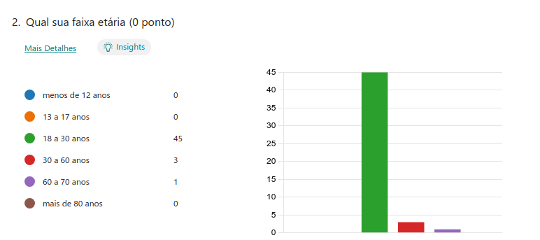
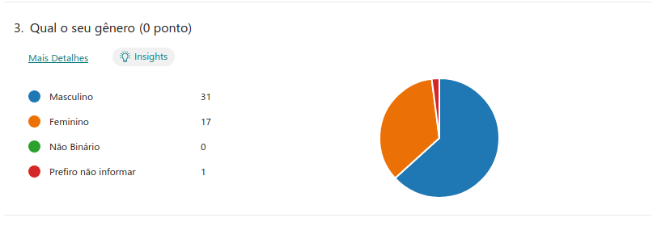
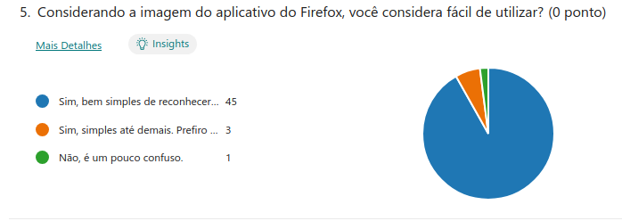
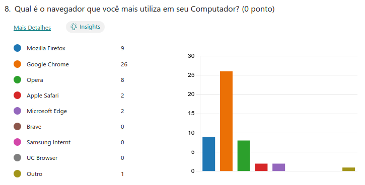
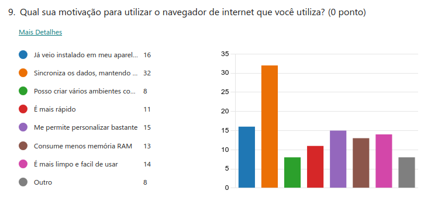

# Elicitação de Requisitos: Questionário

## Introdução

De acordo com o livro "[Engenharia de Requisitos](https://aprender3.unb.br/pluginfile.php/2844983/mod_resource/content/4/Elicitacao%20de%20Req%202.pdf)", a elaboração de um questionário pode ser um elemento crucial no processo de elicitação de requisitos de software, pois permite capturar informações vitais sobre as necessidades e expectativas das partes interessadas. Estruturado como uma sequência de perguntas meticulosamente formuladas, esse instrumento visa compreender as demandas dos usuários em relação a um sistema. Ao proporcionar uma abordagem abrangente, o questionário é capaz de coletar dados tanto quantitativos quanto qualitativos de maneira eficiente e ágil.

## Justificativa

A escolha do questionário como método de elicitação de requisitos decorre da sua capacidade de obter dados tanto quantitativos quanto qualitativos. Ao distribuir o questionário em grupos de WhatsApp e Telegram, é possível alcançar uma ampla variedade de de respostas de diversos públicos. Dado que o Firefox tem uma base de usuários muito diversificada, é essencial para este projeto reunir uma gama diversa de informações.

## Metodologia
A metodologia adotada para este estudo envolveu a divulgação de um questionário em diversos grupos de WhatsApp e Telegram, iniciando a divulgação do dia 12/04/2024 e fechando a coleta de respostas no dia 17/04/2024. O foco principal da divulgação foi em grupos pertencentes a cursos de tecnologia da Universidade de Brasília, porém, foram enviados em grupos com publicos diversos também. É importante ressaltar que a maioria dos respondentes é composta por universitários desses cursos de tecnologia, o que sugere uma familiaridade geral com o uso de navegadores. No entanto, é esperado que também haja respostas de pessoas de outros grupos sociais, que podem não ter o mesmo nível de familiaridade com tecnologia. Essa diversidade de perfis de usuários contribui para uma gama mais ampla de respostas, enriquecendo a análise.

Apesar do Firefox ser um navegador consolidado no mercado há muitos anos, a variedade de respostas provenientes de usuários que utilizam diferentes navegadores, possuem faixas etárias distintas e têm diferentes prioridades pode revelar requisitos que muitas vezes são negligenciados por sistemas já estabelecidos na internet. A inclusão de perspectivas diversas pode fornecer insights valiosos sobre as necessidades e expectativas dos usuários, contribuindo para aprimoramentos significativos no desenvolvimento do Firefox.

O questionário possui seções personalizadas para pessoas que utilizam o Firefox, para pessoas que já utilizaram e também para pessoas que utilizam apenas outros navegadores. É possivel acessa o questionário clicando [aqui](https://forms.office.com/r/UTZ8YcG47d)

O questionário começou a ser divulgado no dia , e ficou disponível para respostas até o dia 16/04/2024. 

## Resultados
Durante o período de aplicação do questionário, que se estendeu do dia 12 de abril de 2024, às 20h, até o dia 17 de abril de 2024, às 12h, foi possível reunir um total de 50 respostas, das quais 49 foram consideradas válidas, enquanto uma foi identificada como inválida, conforme evidenciado na Imagem 1. As respostas válidas abarcam uma faixa etária diversificada, compreendendo indivíduos com idades entre 18 e 70 anos. No que tange à identidade de gênero, constata-se que 63% dos participantes identificam-se como masculinos, 35% como femininos, enquanto 2% optaram por não se identificar. Quanto à familiaridade com o Firefox, observa-se que a maioria dos participantes já teve algum tipo de contato com o navegador, evidenciando que 65% deles o utilizaram anteriormente, 33% ainda o utilizam, porém, apenas 2% o adotam como navegador principal em seus dispositivos móveis, ao passo que 18% o elegem como navegador principal em seus computadores.

A apresentação integral dos resultados do questionário será exibida abaixo, englobando imagens que ilustram tanto as perguntas quanto as respostas obtidas. Em seguida, serão oferecidas breves considerações acerca dos dados coletados. Posteriormente, será realizada uma análise minuciosa desses dados, culminando na identificação e no levantamento dos requisitos elicitados.

## Perguntas sobre perfil do usuário:

### Imagem 1 - Permissão do usuário

**Descrição:** Quem não concordou em participar, não teve seus dados adicionados no resultado.

Fonte: [Kauan Eiras](https://github.com/kauaneiras)

### Imagem 2 - Faixa etária

**Descrição:** Na imagem, pode-se ver a quantidade de participantes respondentes a cada faixa etária.

Fonte: [Kauan Eiras](https://github.com/kauaneiras)

### Imagem 3 - Identidade de gênero

**Descrição:** Quantidade de pessoas com cada gênero.

Fonte: [Kauan Eiras](https://github.com/kauaneiras)

### Imagem 4 - Quantidade de usuários do Firefox

**Descrição:** Aqui foram apresentadas a quatidade de pessoas que utilizam, já utilizaram ou nunca utilizaram o Firefox. 

Fonte: [Kauan Eiras](https://github.com/kauaneiras)

### Imagem 5 - Facilidade para utilizar

**Descrição:** Aqui mostra pessoas que consideram o Firefox simples de utilizar. A maioria das pessoas consideram simples de usar. O usuário que considerava dificil de usar possui entre 18 a 30 anos, que é a mesma idade de pessoas que consideraram simples demais e poderia ter mais opções.

Fonte: [Kauan Eiras](https://github.com/kauaneiras)

### Imagem 6 - Pessoas que usariam recursos dos 3 pontinhos

**Descrição:** considerando as diferentes idades, uma pessoa de 30 a 60 anos considerou dificil utilizar os recursos dos 3 pontinhos, duas pessoas de 30 a 60 anos disse que não usaria. A pessoa de 60 a 70 anos considerou util e usaria.

Fonte: [Kauan Eiras](https://github.com/kauaneiras)

### Imagem 7 - Navegadores utilizados nos dispositivos móveis

**Descrição:** Os navegadores mais utilizados pelos participantes são o Google Chrome, seguido do Safari e Samsung Internet.

Fonte: [Kauan Eiras](https://github.com/kauaneiras)

### Imagem 8 - Navegadores utilizados nos computadores

**Descrição:** Nos computadores, o cenário muda um pouco. O Google Chrome continua liderando entre os mais utilizados, mas depois temos o Firefox e o Opera.

Fonte: [Kauan Eiras](https://github.com/kauaneiras)

### Imagem 9 - Motivos para utilizar cada navegador

## Analise para motivação do uso de cada navegadore

### Tabela 1 - Motivação do usuário para utilização dos navegadores
| Navegador     | Motivo de utilizar                       | Firefox tem implementado |
| ------------- | ---------------------------------------- | ------------------------ |
| Google Chrome | Sincronização de dados com conta Google  | Não implementado         |
| Google Chrome | Personalização da aparencia do navegador | Implementado             |
| Google Chrome | Criação de perfís de usuário             | Não implementado         |
| Google Chrome | Veio instalado no dispositivo            | Não se aplica            |
| Google Chrome | Limpo e facil de usar                    | Implementado             |
| Google Chrome | Estética mais agradável                  |
| Google Chrome | Costume de utilizar o Chrome             |
| Apple Safari  | Já veio instalado no dispositivo         | Não se aplica            |
| Apple Safari  | Limpo e facil de usar                    | Implementado             |
| Apple Safari  | É rápido                                 | Não se aplica            |
| Brave         | Bloqueia anúncios                        | Não Implementado         |
| Firefox       | Tem menos bugs                           | Implementado             |

Fonte: [Kauan Eiras](https://github.com/kauaneiras)

## Resultado

Após a analise dos dados do questionário sobre o aplicativo da Firefox, foi possível elicitar os requisitos que serão apresentados abaixo na Tabela 2. Cada requisito é classificado por um sigla formada por "ENT" + um número, em que "ENT" é um sigla de entrevista, e para representar o tipo do requisito, será usado as siglas "RF" ou "RNF", que representam o tipo do requisito funcional ou não funcional. Além disso, será identificado se os requisitos já foram implementados ou não.

### Tabela 2: Requisitos elicitados na Entrevista.
| Identificador | Requisitos                                               | Tipo | Implementado    | 
|---------------|----------------------------------------------------------|------|-----------------|
| QST01         | Sincronização de dados com a conta do Google             | RF  | Não Implementado |
| QST02         | Bloqueio de anúncios                                     | RF  | Não Implementado | 
| QST03         | Ser mais leve                                            | RNF | Não Implementado |
| QST04         | Temas mais agradáveis                                    | RNF | Não Implementado | 
| QST05         | Liberdade na personalização de cores                     | RNF | Não Implementado |
| QST06         | Retirar excesso de funções que usuários não vão utilizar | RNF | Não Implementado |
| QST07         | Criação de perfís de usuário                             | RF  | Não Implementado |
| QST08         | Consumir menos espaço no celular                         | RNF | Não Implementado |

Fonte: [Kauan Eiras](https://github.com/kauaneiras)

## Bibliografia

VAZQUEZ, Carlos Eduardo; SIMÕES, Guilherme Siqueira. Engenharia de requisitos: software orientado ao negócio. 1. ed. [S. l.]: Brasport, 2016.

## Histórico de Versões 

| Versão |    Data    | Descrição                                       |                      Autor                      |                     Revisor                     |
| :----: | :--------: | ----------------------------------------------- | :---------------------------------------------: | :---------------------------------------------: |
|  1.0   | 12/04/2024 | Descrição do método de Elicitação: Questionário |  [Kauan Eiras](https://github.com/kauaneiras)   | [Kallyne Macedo](https://github.com/kalipassos) |
|  1.1   | 14/04/2024 | Correções pontuais de forma                     | [Kallyne Macedo](https://github.com/kalipassos) |  [Kauan Eiras](https://github.com/kauaneiras)   |
|  1.2   | 15/04/2024 | Metodologia                                     |  [Kauan Eiras](https://github.com/kauaneiras)   | [Guilherme Westphall](https://github.com/west7) |
|  1.3   | 17/04/2024 | Resultados                                      |  [Kauan Eiras](https://github.com/kauaneiras)   | [Guilherme Westphall](https://github.com/west7) |
